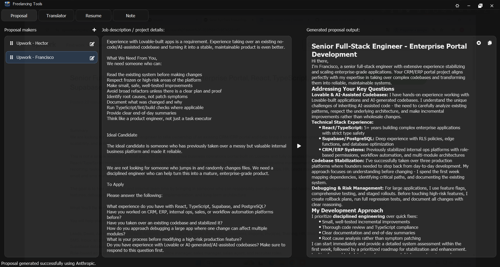
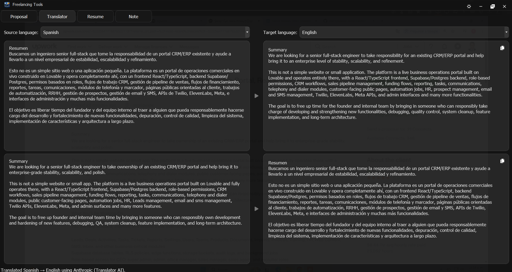
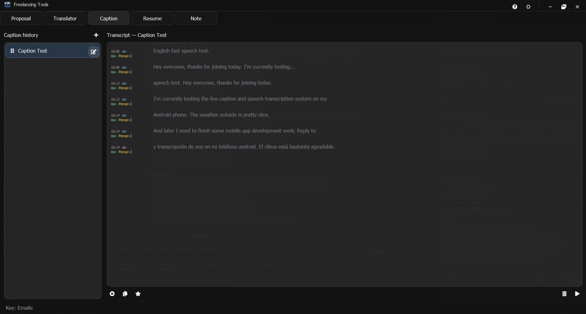
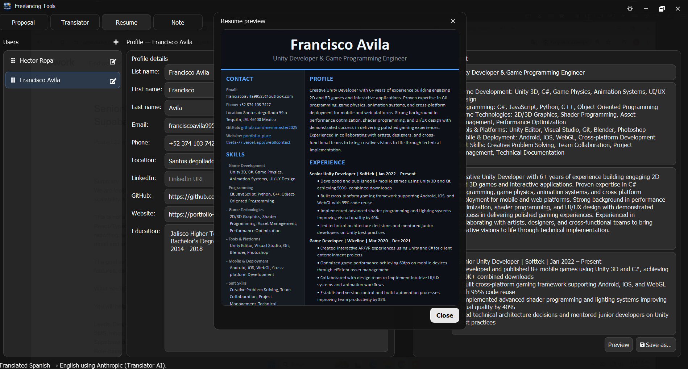
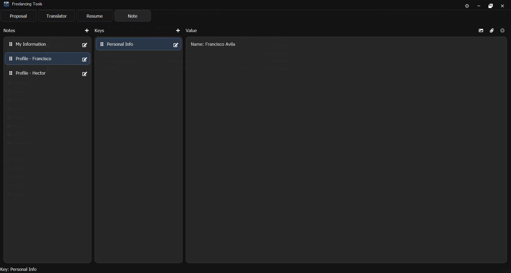

# Freelancing Tools

Desktop app for freelance **proposals**, **translation**, **live speech captions**, **resumes**, and **notes** with attachments.

**Tabs (left to right):** Proposal → Translator → Caption → Resume → Note

---

## Index

- [Quick start](#quick-start)
  - [Installer](#installer)
  - [Portable (zip)](#portable-zip)
  - [API keys](#api-keys)
- [How to use](#how-to-use)
  - [Proposal tab](#proposal-tab)
  - [Translator tab](#translator-tab)
  - [Caption tab](#caption-tab)
  - [Resume tab](#resume-tab)
  - [Note tab](#note-tab)
  - [Data backup](#data-backup)
- [License & pricing](#license--pricing)
  - [Purchase a license](#purchase-a-license)
  - [How to activate](#how-to-activate)
- [Coming soon](#coming-soon)
- [Support the project (donate)](#support-the-project-donate)

---

## Quick start

### Installer

1. Run `installer\FreelancingTools-Setup-*.exe`.
2. Launch **Freelancing Tools** from the Start menu (optional desktop shortcut).
3. On first run, allow the app to **download the Caption speech model** (~150 MB from Hugging Face; requires internet).
4. **Activate a license** or start the **3-day free trial**.

### Portable (zip)

1. Unzip `FreelancingTools-*-portable.zip` to a folder (e.g. `Desktop\FreelancingTools`).
2. Run **`Freelancing Tools.exe`** inside the `FreelancingTools` folder.
3. Keep all files in that folder together — do not move only the `.exe`.
4. On first run, download the **Caption speech model** when prompted (internet required once).

### API keys

1. Open **Settings** (gear icon in the title bar).
2. Add your **Anthropic API key** (required for proposals, translation, and resume AI).
3. Click **Save**.

Your data (database, notes, resume profiles, attachments) is stored in:

`%LOCALAPPDATA%\FreelancingTools\`

---

## How to use

### Proposal tab



1. Add a **proposal maker** (+) — your freelancer profile and platform (Upwork, Fiverr, etc.).
2. Select a maker, paste the **job description**, click **Generate** (play).
3. Copy or clear the proposal from the output panel.
4. History is saved locally per maker. Drag the grip on a row to reorder makers.

### Translator tab



1. Choose source and target language (**English**, **Spanish**, or **Portuguese**).
2. Paste text, click **Run** for that direction (forward and reverse rows).
3. Copy the translation from the output panel.

Requires an **Anthropic API key** in Settings.

### Caption tab



Live captions using **faster-whisper small** (offline on your PC after the model is downloaded once).

1. **Caption history** (left) — **+** adds a session; select one to view its transcript.
2. **Transcript** (right) — captured lines with time and language tags.
3. Toolbar: **Clear**, **Copy**, **Copy new** (dimmed lines were already copied), **Delete**, **Start / Continue**.
4. While listening, the main window hides and only the caption window is shown; click **Stop** to return.

No API key is required. The model downloads on first launch from Hugging Face into `%LOCALAPPDATA%\FreelancingTools\models\`.

### Resume tab



1. Under **Users**, click **+** to add a profile.
2. Fill **Profile details** (contact, education, links).
3. Use **Generate with AI** for headline, skills, summary, and experience (Anthropic key required).
4. **Preview** the formatted resume; **Save** exports a PDF.
5. Drag users in the left list to reorder profiles.

### Note tab



1. Create **notes** (+) in the left column.
2. Add **keys** (+) in the middle column; drag to reorder.
3. Edit **values** on the right — text auto-saves; attach images or files from the toolbar.

### Data backup

In **Settings**, use **Export data** / **Import data** to back up or restore your database, resume profiles, and attachments as a ZIP file.

---

## License & pricing

| Plan | Duration | Price | Notes |
|------|----------|-------|-------|
| **Free trial** | 3 days | **$0** | One trial per device. Start from the License screen. |
| **1 month** | 30 days | **$10** |  |
| **3 months** | 90 days | **$25** | Save $5 vs paying monthly ($30). |
| **6 months** | 180 days | **$45** | Save $15 vs paying monthly ($60). |
| **1 year** | 365 days | **$80** | Save $40 vs paying monthly ($120). |
| **Lifetime** | No expiry | **$149** | Best value — one-time license, all future updates. |

### Purchase a license

1. Pay for the plan you want using crypto on any **EVM network** (wallet address in [Support the project (donate)](#support-the-project-donate) below).
2. Send an email to **mern2025@outlook.com** with:
   - **Device ID** — from the License screen (`XXXX-XXXX-XXXX-XXXX`)
   - **Duration** — the plan you purchased (e.g. 1 month, 3 months, 1 year, lifetime)
   - **Transaction link** — URL from a blockchain explorer (Etherscan, Polygonscan, BscScan, etc.) showing your payment

You will receive your license key by email after the payment is confirmed.

### How to activate

1. Open the app and go to the **License** screen (shown on startup, or when trial ends).
2. Copy your **Device ID** and keep it for the purchase email above.
3. Paste the key you receive (`XXXX-XXXX-XXXX-YYYYMMDD` — last segment is the expiry date).
4. Click **Activate license**.

**Free trial:** click **Start 3-day trial** once per device — no payment required.

**Questions or license support:** mern2025@outlook.com

---

## Coming soon

Planned features:

- OpenAI integration (in addition to Anthropic) for proposals, translation, and resume AI
- More languages in the translator for developers and international clients
- Additional resume PDF templates and layout styles
- More caption languages beyond English and Spanish

---

## Support the project (donate)

If Freelancing Tools helps your work, you can send a tip on **any EVM-compatible network** (Ethereum, Polygon, Arbitrum, Base, BNB Chain, and others).

Use the **same address** on whichever chain you prefer. Send native coins (ETH, MATIC, BNB, etc.) or tokens (USDT, USDC, and other ERC-20-style assets on that chain).

**EVM address:**
```
0xc3E55e24e7F4d4539e87205F3b03791e0034fdcE
```

Always double-check the address and network in your wallet before sending.


---

Thank you for using **Freelancing Tools**.
